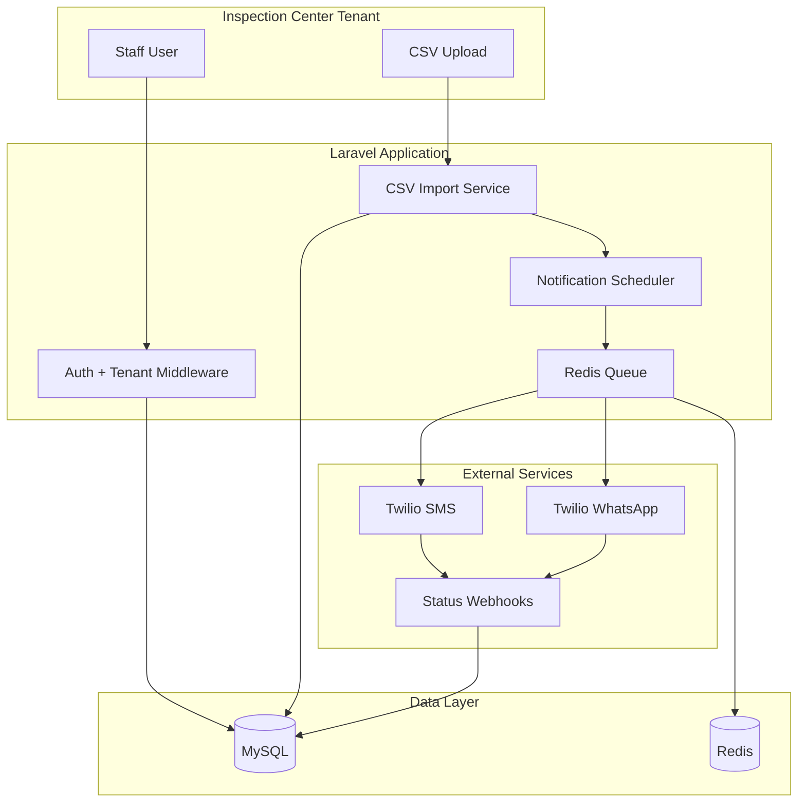

# Visite Technique Platform

Enterprise-grade Laravel platform for roadworthiness inspection centers (*Visite Technique*). Import daily inspection CSV files, track certificate expiry dates, and send automated SMS and WhatsApp reminders to customers — with multi-tenant SaaS support from day one.

## Features

- **Multi-tenant SaaS** — Multiple inspection centers on one platform with isolated data
- **Daily CSV import** — Async processing with validation, dry-run, and progress tracking
- **Automated reminders** — SMS and WhatsApp notifications before certificate expiry
- **Duplicate detection** — License plate + expiry date per tenant
- **Customer & vehicle management** — Full CRUD with inspection history
- **Analytics dashboard** — Inspections, expiring vehicles, delivery stats
- **Delivery tracking** — Twilio webhooks for SMS/WhatsApp status
- **Role-based access** — Super-admin, center-admin, operator
- **Audit trail** — Activity logging for imports and notifications
- **French-first UI** — Localization with English fallback (Cameroon context)

## Tech Stack

| Component | Technology |
|-----------|------------|
| Backend | Laravel 11, PHP 8.3 |
| Frontend | Blade, Livewire 3, Tailwind CSS |
| Database | MySQL 8 |
| Queue / Cache | Redis, Laravel Horizon |
| Notifications | Twilio (SMS + WhatsApp Business API) |
| CSV Import | Laravel Excel (Maatwebsite) |
| Auth | Laravel Breeze + Spatie Permission |
| Charts | Chart.js |
| Testing | Pest PHP |
| Dev environment | Docker Compose |

## Architecture Overview



## Prerequisites

**Option A — Docker (recommended)**

- Docker Desktop or Docker Engine + Docker Compose v2

**Option B — Manual**

- PHP 8.3 with extensions: `cli`, `mysql`, `curl`, `xml`, `mbstring`, `zip`, `bcmath`, `gd`, `redis`
- Composer 2.x
- Node.js 20+ and npm
- MySQL 8
- Redis 7

## Quick Start (Docker)

> Documentation is in place. Laravel application scaffolding is Phase 1 — run these steps after `composer create-project` is completed.

```bash
# Clone the repository
git clone <repository-url> visite-tech-platform
cd visite-tech-platform

# Copy environment file
cp .env.example .env

# Start services (PHP, MySQL, Redis, Mailpit)
docker compose up -d

# Install dependencies (after Laravel is scaffolded)
composer install
npm install

# Generate key and run migrations
php artisan key:generate
php artisan migrate --seed

# Build frontend assets
npm run dev

# Start queue worker (separate terminal)
php artisan horizon
```

Access the application at `http://localhost:8080` (port configured in `docker-compose.yml`).

## Environment Variables

Key variables (see [`.env.example`](.env.example) for the full list):

| Variable | Description |
|----------|-------------|
| `APP_NAME` | Application display name |
| `DB_*` | MySQL connection settings |
| `REDIS_*` | Redis host for queue, cache, sessions |
| `QUEUE_CONNECTION` | Set to `redis` |
| `TWILIO_ACCOUNT_SID` | Twilio account identifier |
| `TWILIO_AUTH_TOKEN` | Twilio auth token (encrypted per-tenant in DB for production) |
| `TWILIO_SMS_FROM` | Default SMS sender number |
| `TWILIO_WHATSAPP_FROM` | WhatsApp-enabled Twilio number |
| `DEFAULT_PHONE_COUNTRY` | ISO country for phone normalization (default: `CM`) |
| `APP_LOCALE` | Default UI locale (`fr`) |

Per-tenant Twilio credentials are stored encrypted in `center_settings` and override globals when configured.

## User Roles

| Role | Scope | Capabilities |
|------|-------|--------------|
| `super-admin` | Platform-wide | Manage tenants, plans, platform metrics |
| `center-admin` | Single tenant | Manage staff, settings, imports, templates |
| `operator` | Single tenant | Upload CSV, view customers/vehicles, reports |

## Project Structure (Planned)

```
app/
├── Http/Middleware/          # TenantScope, role checks
├── Models/                   # Customer, Vehicle, Inspection, etc.
├── Services/
│   ├── Import/               # CSV validation, normalization
│   └── Notifications/        # Twilio channels, scheduler
├── Jobs/                     # ProcessImport, SendNotification
└── Imports/                  # Laravel Excel import classes
docs/                         # Project documentation (this repo phase)
resources/views/              # Blade + Livewire components
routes/
├── web.php                   # Authenticated tenant routes
└── webhooks.php              # Twilio callbacks (no CSRF)
```

## Documentation

| Document | Description |
|----------|-------------|
| [docs/PLAN.md](docs/PLAN.md) | Master development plan (6 phases) |
| [docs/ARCHITECTURE.md](docs/ARCHITECTURE.md) | System design, multi-tenancy, services |
| [docs/DATABASE.md](docs/DATABASE.md) | Schema, ERD, indexes, tenant scoping |
| [docs/CSV-FORMAT.md](docs/CSV-FORMAT.md) | Import column spec and validation |
| [docs/NOTIFICATIONS.md](docs/NOTIFICATIONS.md) | Twilio setup, templates, webhooks |
| [docs/DEPLOYMENT.md](docs/DEPLOYMENT.md) | Production deployment guide |
| [docs/TESTING.md](docs/TESTING.md) | Test strategy and CI pipeline |
| [docs/ROADMAP.md](docs/ROADMAP.md) | Phased delivery timeline |

## Development Workflow

```bash
# Code style
./vendor/bin/pint

# Static analysis
./vendor/bin/phpstan analyse

# Run tests
php artisan test

# Scheduler (add to crontab in production)
* * * * * cd /path-to-project && php artisan schedule:run >> /dev/null 2>&1
```

## Contributing

1. Create a feature branch from `main`
2. Follow PSR-12 and Laravel conventions (Pint enforced)
3. Add Pest tests for new business logic
4. Open a pull request with a clear description and test plan

## License

Proprietary — All rights reserved. Contact the project owner for licensing terms.
