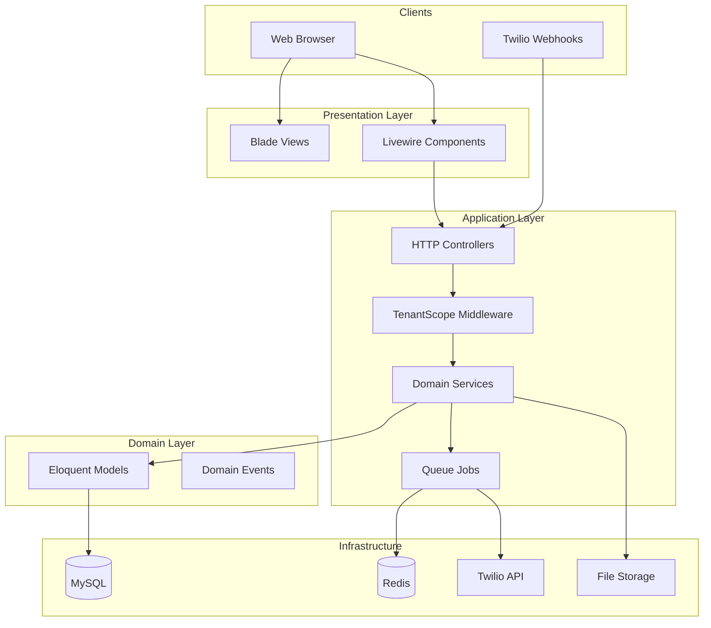
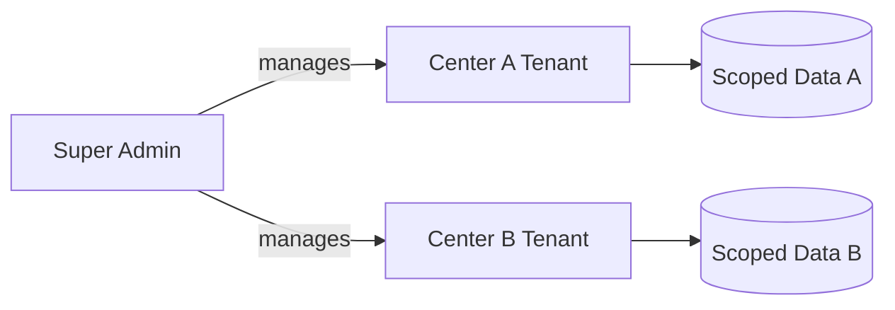
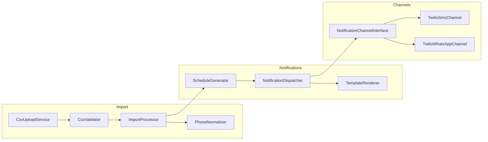
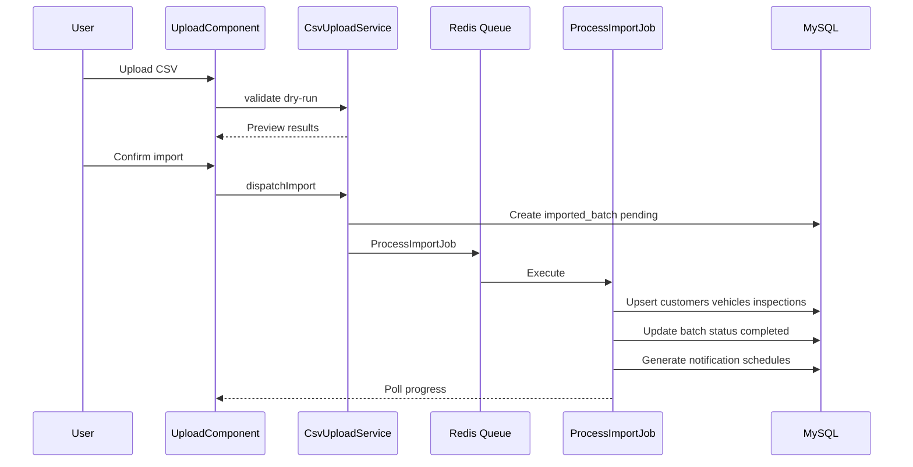
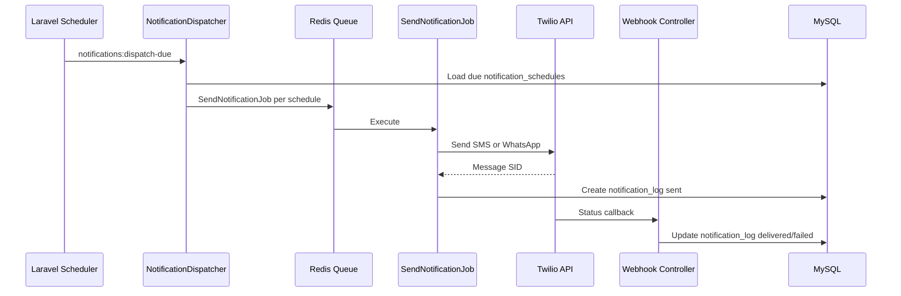
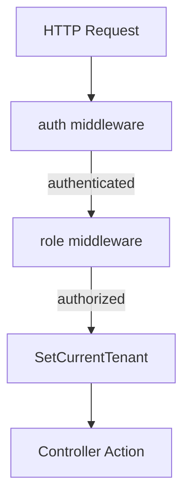

# System Architecture — Visite Technique Platform

Technical design for the multi-tenant Laravel SMS/WhatsApp notification platform.

---

## High-Level Architecture



---

## Multi-Tenancy Design

### Tenant Model

Each **inspection center** is a tenant (`inspection_centers` table). All business data is scoped by `inspection_center_id`.



### Tenant Resolution

1. User authenticates via Laravel Breeze
2. `users.inspection_center_id` set (null for super-admin)
3. `TenantScope` middleware sets `app('currentTenant')` from authenticated user
4. `BelongsToTenant` global scope filters all Eloquent queries
5. Super-admin routes use `withoutGlobalScope(TenantScope::class)` explicitly

### Key Classes (Planned)

| Class | Responsibility |
|-------|----------------|
| `TenantScope` | Eloquent global scope filtering by `inspection_center_id` |
| `BelongsToTenant` | Trait applied to tenant-scoped models |
| `SetCurrentTenant` | Middleware resolving tenant from auth user |
| `TenantService` | Tenant CRUD, settings, onboarding |

### Data Isolation Rules

- Never query tenant data without scope (except super-admin)
- Foreign keys include `inspection_center_id` on child tables
- Composite unique indexes include `inspection_center_id`
- File uploads stored under `storage/app/tenants/{center_id}/imports/`

---

## Service Layer



### Service Responsibilities

| Service | Methods (illustrative) | Notes |
|---------|------------------------|-------|
| `CsvUploadService` | `store()`, `validate()`, `dispatchImport()` | Handles file storage and batch creation |
| `CsvValidator` | `validateHeaders()`, `validateRow()` | Returns row-level errors |
| `ImportProcessor` | `processBatch()`, `upsertRecords()` | Runs in `ProcessImportJob` |
| `PhoneNormalizer` | `toE164()` | libphonenumber, tenant default country |
| `ScheduleGenerator` | `generateForInspection()` | Idempotent schedule rows |
| `NotificationDispatcher` | `dispatchDue()`, `send()` | Called by scheduler and jobs |
| `TemplateRenderer` | `render()` | Replaces `{{placeholders}}` |

---

## CSV Import Flow



---

## Notification Flow



---

## Queue Architecture

| Queue | Jobs | Priority |
|-------|------|----------|
| `imports` | `ProcessImportJob` | Normal |
| `notifications` | `SendNotificationJob` | High |
| `default` | `RetryFailedNotificationJob` | Low |

Horizon supervises workers per queue. Failed jobs after 3 retries move to `failed_jobs` table for manual review.

### Retry Policy

| Attempt | Delay |
|---------|-------|
| 1 | Immediate |
| 2 | 5 minutes |
| 3 | 30 minutes |

Permanent failures (invalid number, template rejected) are not retried; status set to `failed` with error message.

---

## Authentication & Authorization Flow



Super-admin routes: prefix `/admin`, middleware `role:super-admin`, no tenant scope.

Tenant routes: prefix `/app`, middleware `role:center-admin|operator`, tenant scope active.

---

## Webhook Architecture

Twilio callbacks hit stateless routes (CSRF exempt):

| Route | Method | Purpose |
|-------|--------|---------|
| `/webhooks/twilio/sms` | POST | SMS delivery status |
| `/webhooks/twilio/whatsapp` | POST | WhatsApp delivery status |

Validation: `Twilio\Security\RequestValidator` with `X-Twilio-Signature` header.

Lookup `notification_logs` by `provider_message_id` (Twilio Message SID) and update `status`, `delivered_at`, `error_code`.

---

## Caching Strategy

| Key pattern | TTL | Purpose |
|-------------|-----|---------|
| `tenant:{id}:settings` | 1 hour | Center settings |
| `tenant:{id}:dashboard` | 5 minutes | Dashboard widget aggregates |
| `platform:metrics` | 15 minutes | Super-admin metrics |

Invalidate on settings update or import completion.

---

## File Storage

```
storage/app/tenants/{inspection_center_id}/imports/{batch_uuid}.csv
```

Retention: 90 days, cleaned by `imports:cleanup` scheduler.

---

## Health Check

`GET /health` returns JSON:

```json
{
  "status": "ok",
  "checks": {
    "database": "ok",
    "redis": "ok",
    "queue": "ok"
  }
}
```

Used by load balancers and uptime monitors. Returns `503` if any check fails.

---

## Localization

- Default locale: `fr` (French)
- Fallback: `en` (English)
- Per-tenant override via `center_settings.locale`
- Message templates stored per tenant in French with optional English variant

---

## Future Extensibility

| Extension | Approach |
|-----------|----------|
| Orange / MTN SMS | New `NotificationChannelInterface` implementation |
| Stripe billing | Activate `plans` / `subscriptions` tables |
| Mobile API | Laravel Sanctum token auth, same tenant scope |
| Multi-region | Tenant `timezone` on `center_settings` |

---

## Related Documentation

- [DATABASE.md](DATABASE.md) — Schema and indexes
- [NOTIFICATIONS.md](NOTIFICATIONS.md) — Twilio integration
- [PLAN.md](PLAN.md) — Development phases
