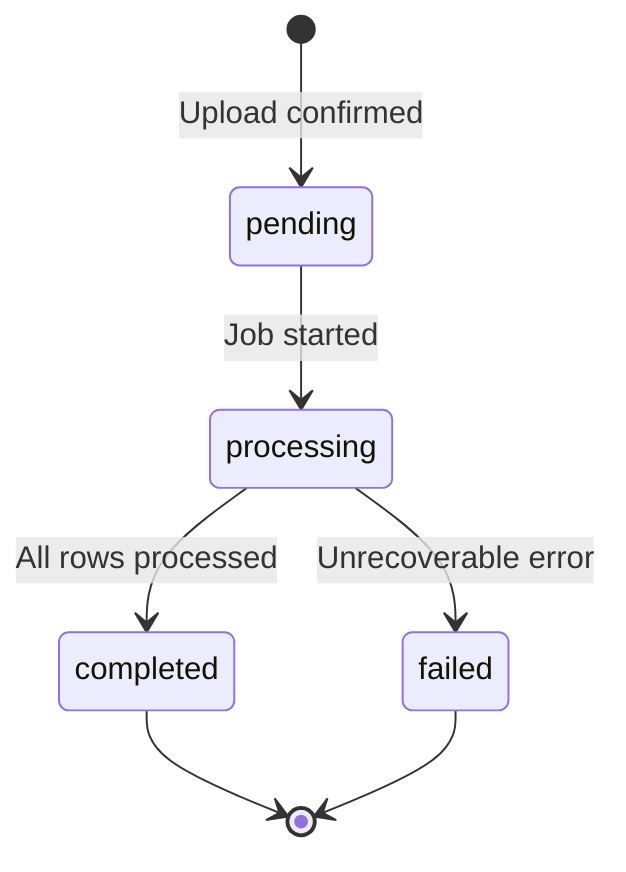

# CSV Import Format — Visite Technique Platform

Specification for daily inspection CSV files uploaded by roadworthiness centers.

---

## File Requirements

| Requirement | Value |
|-------------|-------|
| Format | CSV (UTF-8) |
| Delimiter | Comma (`,`) |
| Header row | Required (first row) |
| Max file size | 10 MB (configurable) |
| Max rows per import | 50,000 (configurable) |

---

## Required Columns

Column headers are **case-insensitive** and trimmed. Accepted aliases are listed below.

| Canonical Name | Accepted Aliases | Type | Required | Example |
|----------------|------------------|------|----------|---------|
| `customer_name` | `nom`, `name`, `client` | string | Yes | `Jean Dupont` |
| `phone` | `telephone`, `tel`, `mobile` | string | Yes | `677123456` or `+237677123456` |
| `license_plate` | `immatriculation`, `plate`, `plaque` | string | Yes | `LT-123-AB` |
| `expiry_date` | `date_expiration`, `expiration` | date | Yes | `2026-08-15` |
| `inspection_date` | `date_visite`, `visit_date` | date | No | `2025-08-15` |
| `make` | `marque`, `brand` | string | No | `Toyota` |
| `model` | `modele` | string | No | `Corolla` |
| `year` | `annee` | integer | No | `2018` |
| `certificate_number` | `numero_certificat`, `certificat` | string | No | `VT-2025-001234` |
| `result` | `resultat` | enum | No | `pass` |
| `email` | `courriel` | string | No | `jean@example.com` |

---

## Date Formats

Accepted formats (parsed in order):

1. `YYYY-MM-DD` (ISO 8601) — **preferred**
2. `DD/MM/YYYY`
3. `DD-MM-YYYY`

Invalid or ambiguous dates are rejected with a row-level error.

---

## Phone Number Normalization

1. Strip spaces, dashes, parentheses
2. Parse with `libphonenumber-for-php`
3. Default region from tenant `center_settings.default_phone_country` (default: `CM`)
4. Store as E.164 (e.g. `+237677123456`)

| Input | Normalized (CM default) |
|-------|-------------------------|
| `677123456` | `+237677123456` |
| `237677123456` | `+237677123456` |
| `+237 677 123 456` | `+237677123456` |

Invalid numbers: row rejected, logged in `imported_batches.error_log`.

---

## License Plate Normalization

- Trim whitespace
- Convert to uppercase
- Remove internal spaces (configurable per tenant)
- Example: `lt 123 ab` → `LT123AB`

---

## Validation Rules

### File-Level

| Rule | Error Code |
|------|------------|
| Missing required column headers | `MISSING_HEADER` |
| Empty file (headers only) | `EMPTY_FILE` |
| Exceeds max rows | `TOO_MANY_ROWS` |
| Invalid file encoding | `INVALID_ENCODING` |

### Row-Level

| Rule | Error Code |
|------|------------|
| Missing `customer_name` | `MISSING_NAME` |
| Missing or invalid `phone` | `INVALID_PHONE` |
| Missing `license_plate` | `MISSING_PLATE` |
| Missing `expiry_date` | `MISSING_EXPIRY` |
| Invalid date format | `INVALID_DATE` |
| `expiry_date` in the past (> 30 days ago) | `EXPIRED_CERTIFICATE` |
| Invalid `result` value | `INVALID_RESULT` |
| Duplicate in same file (plate + expiry) | `DUPLICATE_IN_FILE` |

### Database-Level (on persist)

| Rule | Action |
|------|--------|
| Existing inspection (tenant + plate + expiry) | Skip row, increment `skipped_count` |
| Existing customer (tenant + phone) | Update name if changed |
| Existing vehicle (tenant + plate) | Link to customer, update make/model |
| New combination | Create customer, vehicle, inspection |

---

## Duplicate Detection

**Key:** `inspection_center_id` + `license_plate` (via vehicle) + `expiry_date`

Re-importing the same certificate does not create a duplicate inspection or duplicate notification schedules (idempotent unique index on schedules).

---

## Dry-Run Mode

When `is_dry_run = true` on the batch:

1. Full validation runs against uploaded file
2. No database writes (except `imported_batches` metadata)
3. Returns preview:

```json
{
  "total_rows": 150,
  "would_create": 45,
  "would_update": 12,
  "would_skip": 88,
  "errors": 5,
  "error_samples": [
    { "row": 23, "code": "INVALID_PHONE", "message": "..." }
  ]
}
```

User confirms before dispatching real import job.

---

## Sample CSV

Download template: `storage/app/templates/inspection_import_template.csv`

```csv
customer_name,phone,license_plate,inspection_date,expiry_date,make,model,year,certificate_number,result,email
Jean Dupont,677123456,LT-123-AB,2025-08-15,2026-08-15,Toyota,Corolla,2018,VT-2025-001234,pass,jean@example.com
Marie Ngo,690987654,CE-456-CD,2025-09-01,2026-09-01,Honda,Civic,2020,VT-2025-001235,pass,
Paul Mbarga,+237655111222,DL-789-EF,2025-07-20,2026-07-20,Nissan,Sentra,2015,VT-2025-001236,pass,paul@example.com
```

---

## Import Processing (Async)



Progress fields on `imported_batches`:

- `total_rows` — rows excluding header
- `processed_rows` — rows processed so far
- `created_count`, `updated_count`, `skipped_count`, `error_count`

Livewire component polls batch status every 2 seconds during processing.

---

## Post-Import Actions

After successful import:

1. `ScheduleGenerator` creates `notification_schedules` for each new/updated inspection
2. Activity log entry: `csv_imported` with batch UUID and counts
3. Dashboard cache invalidated for tenant

---

## Error Log Format

Stored in `imported_batches.error_log` (JSON array, max 1000 entries):

```json
[
  {
    "row": 23,
    "code": "INVALID_PHONE",
    "message": "Phone number could not be parsed",
    "raw": { "phone": "abc123" }
  }
]
```

---

## Related Documentation

- [DATABASE.md](DATABASE.md) — Target tables for import data
- [ARCHITECTURE.md](ARCHITECTURE.md) — Import service flow
- [PLAN.md](PLAN.md) — Phase 2 implementation tasks
