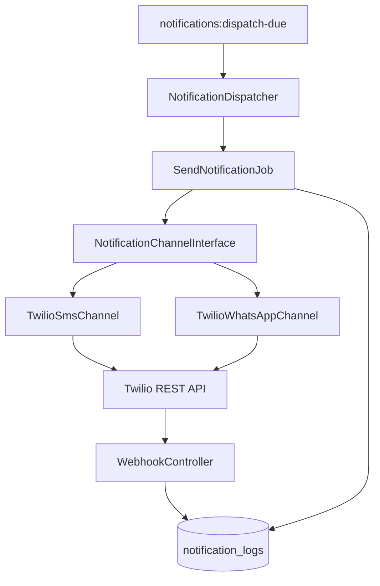

# Notifications — Twilio SMS & WhatsApp

Integration guide for automated reminders via Twilio.

---

## Overview

| Channel | Twilio Product | Address Format |
|---------|----------------|----------------|
| SMS | Programmable Messaging | `+237677123456` |
| WhatsApp | WhatsApp Business API | `whatsapp:+237677123456` |

Both channels use the same `twilio/sdk` client and `NotificationChannelInterface` abstraction.

---

## Twilio Account Setup

### 1. Create Twilio Account

1. Register at [https://www.twilio.com](https://www.twilio.com)
2. Note `Account SID` and `Auth Token` from Console
3. For production: enable sub-accounts per tenant (optional)

### 2. SMS Number

1. Console → Phone Numbers → Buy a number (Cameroon or international)
2. Set `TWILIO_SMS_FROM` in `.env` (e.g. `+1234567890`)

### 3. WhatsApp Sandbox (Development)

1. Console → Messaging → Try WhatsApp
2. Join sandbox by sending join code from test phone
3. Set `TWILIO_WHATSAPP_FROM=whatsapp:+14155238886` (sandbox number)

### 4. WhatsApp Production

1. Apply for WhatsApp Business via Twilio
2. Create and submit **Content Templates** for approval
3. Store approved `Content SID` in `message_templates.twilio_content_sid`
4. Production sender: your approved WhatsApp-enabled number

---

## Environment Variables

```env
TWILIO_ACCOUNT_SID=ACxxxxxxxxxxxxxxxxxxxxxxxxxxxxxxxx
TWILIO_AUTH_TOKEN=your_auth_token
TWILIO_SMS_FROM=+1234567890
TWILIO_WHATSAPP_FROM=whatsapp:+14155238886

# Webhook validation (optional override)
TWILIO_WEBHOOK_AUTH_TOKEN=
```

Per-tenant overrides stored encrypted in `center_settings` take precedence when set.

---

## Service Architecture



---

## NotificationChannelInterface

```php
interface NotificationChannelInterface
{
    public function send(
        string $to,
        string $body,
        ?string $contentSid = null,
        array $contentVariables = []
    ): SendResult;
}
```

| Implementation | Channel | Notes |
|----------------|---------|-------|
| `TwilioSmsChannel` | SMS | Free-form body |
| `TwilioWhatsAppChannel` | WhatsApp | Requires approved template for outbound (production) |

---

## SMS Sending

```php
$client->messages->create($to, [
    'from' => $from,
    'body' => $renderedBody,
    'statusCallback' => route('webhooks.twilio.sms'),
]);
```

- `$to` — E.164 phone number
- `$from` — Tenant or global `twilio_sms_from`
- `statusCallback` — Delivery webhook URL (HTTPS in production)

---

## WhatsApp Sending

### Sandbox (Development)

```php
$client->messages->create("whatsapp:{$to}", [
    'from' => $whatsappFrom,
    'body' => $renderedBody,
    'statusCallback' => route('webhooks.twilio.whatsapp'),
]);
```

### Production (Template Required)

```php
$client->messages->create("whatsapp:{$to}", [
    'from' => $whatsappFrom,
    'contentSid' => $template->twilio_content_sid,
    'contentVariables' => json_encode([
        '1' => $customerName,
        '2' => $licensePlate,
        '3' => $expiryDate,
    ]),
    'statusCallback' => route('webhooks.twilio.whatsapp'),
]);
```

---

## Message Templates

Stored in `message_templates` per tenant.

### Placeholders

| Placeholder | Source |
|-------------|--------|
| `{{customer_name}}` | `customers.full_name` |
| `{{license_plate}}` | `vehicles.license_plate` |
| `{{expiry_date}}` | `inspections.expiry_date` (formatted) |
| `{{days_remaining}}` | Calculated from expiry |
| `{{center_name}}` | `inspection_centers.name` |

### Example SMS Template (French)

```text
Bonjour {{customer_name}}, votre certificat de visite technique pour le vehicule {{license_plate}} expire le {{expiry_date}}. Merci de prendre rendez-vous. — {{center_name}}
```

### Example WhatsApp Template (for Twilio approval)

```text
Bonjour {{1}}, le certificat de visite technique du vehicule {{2}} expire le {{3}}. Contactez {{4}} pour renouveler.
```

Map variables `1`–`4` in `contentVariables` when sending.

---

## Reminder Schedule

Default reminder windows (configurable per tenant in `center_settings.reminder_days`):

| Days Before Expiry | Typical Send Time |
|--------------------|-------------------|
| 30 | 09:00 tenant timezone |
| 15 | 09:00 |
| 7 | 09:00 |
| 1 | 09:00 |

`scheduled_at` = `expiry_date - reminder_days_before` at 09:00 in tenant timezone.

Scheduler command `notifications:dispatch-due` runs every 15 minutes and dispatches rows where `scheduled_at <= now()` and `status = pending`.

---

## Idempotency

Unique index on `notification_schedules`:

```
(inspection_id, channel, reminder_days_before)
```

Re-importing the same inspection does not create duplicate schedules.

---

## Webhooks

### Routes

| Route | Name | CSRF |
|-------|------|------|
| `POST /webhooks/twilio/sms` | `webhooks.twilio.sms` | Exempt |
| `POST /webhooks/twilio/whatsapp` | `webhooks.twilio.whatsapp` | Exempt |

### Signature Validation

```php
$validator = new RequestValidator($authToken);
$isValid = $validator->validate(
    $request->header('X-Twilio-Signature'),
    $request->fullUrl(),
    $request->post()
);
```

Reject with `403` if invalid.

### Status Mapping

| Twilio Status | `notification_logs.status` |
|---------------|---------------------------|
| `queued` | `queued` |
| `sent` | `sent` |
| `delivered` | `delivered` |
| `undelivered` | `undelivered` |
| `failed` | `failed` |

Update `delivered_at` on `delivered`.

---

## Retry Policy

| Scenario | Action |
|----------|--------|
| HTTP 5xx / timeout | Retry up to 3 times (5 min, 30 min backoff) |
| Invalid phone number | Mark `failed`, no retry |
| Template not approved | Mark `failed`, alert center-admin |
| Rate limit (429) | Retry with delay |

Command `notifications:retry-failed` runs hourly for retriable failures.

---

## Customer Opt-In

Before sending, check:

- `customers.sms_opt_in` for SMS channel
- `customers.whatsapp_opt_in` for WhatsApp channel
- `customers.marketing_consent_at` not null (recommended)

Skip send and set schedule status to `cancelled` if opted out.

---

## Testing

### Twilio Test Credentials

Use test `Account SID` and `Auth Token` from Twilio Console (Test Credentials section).

### Magic Numbers

| Number | Behavior |
|--------|----------|
| `+15005550006` | SMS success |
| `+15005550001` | SMS invalid number |

### PHPUnit / Pest

Mock `Twilio\Rest\Client` via Laravel service container binding in `tests/TestCase.php`.

```php
$this->mock(TwilioSmsChannel::class, function ($mock) {
    $mock->shouldReceive('send')->andReturn(new SendResult('SM123', 'sent'));
});
```

---

## Monitoring

- **Horizon** — `notifications` queue depth and throughput
- **Dashboard** — Failed count widget, link to failed logs
- **Logs** — Structured: `tenant_id`, `schedule_id`, `provider_message_id`

---

## Related Documentation

- [ARCHITECTURE.md](ARCHITECTURE.md) — Notification flow diagrams
- [DATABASE.md](DATABASE.md) — `notification_schedules`, `notification_logs`
- [DEPLOYMENT.md](DEPLOYMENT.md) — Webhook URL and HTTPS requirements
