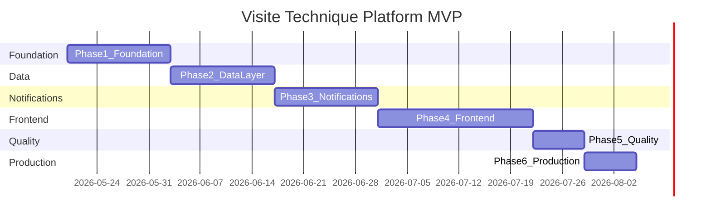

# Product Roadmap — Visite Technique Platform

Phased delivery timeline from documentation to production MVP.

**Target MVP:** ~11 weeks | **Architecture:** Multi-tenant SaaS + Twilio

---

## Timeline Overview

| Phase | Duration | Cumulative |
|-------|----------|------------|
| Phase 1 — Foundation | 2 weeks | Week 2 |
| Phase 2 — Data Layer | 2 weeks | Week 4 |
| Phase 3 — Notifications | 2 weeks | Week 6 |
| Phase 4 — Frontend | 3 weeks | Week 9 |
| Phase 5 — Quality | 1 week | Week 10 |
| Phase 6 — Production | 1 week | Week 11 |

---

## Phase 0 — Documentation (Current)

**Status:** Complete

| Deliverable | Status |
|-------------|--------|
| README.md | Done |
| docs/PLAN.md | Done |
| docs/ARCHITECTURE.md | Done |
| docs/DATABASE.md | Done |
| docs/CSV-FORMAT.md | Done |
| docs/NOTIFICATIONS.md | Done |
| docs/DEPLOYMENT.md | Done |
| docs/TESTING.md | Done |
| docs/ROADMAP.md | Done |
| docker-compose.yml | Done |
| .env.example | Done |

---

## Phase 1 — Foundation (Weeks 1–2)

### Goals

- Laravel 11 project scaffolded
- Docker Compose dev environment working
- Multi-tenant core (middleware, traits, models)
- Authentication with Breeze + Spatie roles
- Super-admin tenant management

### Tasks

- [ ] `composer create-project laravel/laravel .`
- [ ] Install Breeze (Livewire), Spatie Permission, Horizon
- [ ] Configure Docker Compose (PHP, Nginx, MySQL, Redis, Mailpit)
- [ ] Migrations: `inspection_centers`, `center_settings`, extend `users`
- [ ] `TenantScope`, `BelongsToTenant`, `SetCurrentTenant` middleware
- [ ] Seed roles: super-admin, center-admin, operator
- [ ] Super-admin: CRUD inspection centers
- [ ] Center-admin: login to tenant dashboard shell

### Acceptance Criteria

- Super-admin creates a new inspection center
- Center-admin logs in and sees only their tenant context
- `docker compose up` starts full dev stack

### Milestone

**M1 — Tenant-ready auth** (end of Week 2)

---

## Phase 2 — Data Layer (Weeks 3–4)

### Goals

- Full database schema implemented
- CSV import with validation, dry-run, async processing
- Duplicate detection and phone normalization

### Tasks

- [ ] Migrations: customers, vehicles, inspections, imported_batches
- [ ] Eloquent models with factories and tenant scope
- [ ] `CsvValidator`, `PhoneNormalizer`, `ImportProcessor` services
- [ ] `InspectionImport` (Laravel Excel) + `ProcessImportJob`
- [ ] Dry-run preview API for Livewire
- [ ] `ScheduleGenerator` creates notification schedules on import
- [ ] Sample CSV template downloadable

### Acceptance Criteria

- Valid CSV creates customers, vehicles, inspections
- Duplicate plate+expiry rows skipped
- Invalid phones reported in error log
- Dry-run shows accurate preview counts

### Milestone

**M2 — Import pipeline live** (end of Week 4)

---

## Phase 3 — Notifications (Weeks 5–6)

### Goals

- Twilio SMS and WhatsApp integration
- Scheduler dispatches due reminders
- Webhooks update delivery status

### Tasks

- [ ] `NotificationChannelInterface`, `TwilioSmsChannel`, `TwilioWhatsAppChannel`
- [ ] `message_templates` CRUD (center-admin)
- [ ] `SendNotificationJob` with retry policy
- [ ] `notifications:dispatch-due` and `notifications:retry-failed` commands
- [ ] Webhook routes with signature validation
- [ ] `notification_logs` status lifecycle
- [ ] Customer opt-in checks before send

### Acceptance Criteria

- Due schedule sends SMS via Twilio test credentials
- WhatsApp sandbox message delivered
- Webhook updates log to `delivered`
- Failed sends retried up to 3 times

### Milestone

**M3 — Notifications end-to-end** (end of Week 6)

---

## Phase 4 — Frontend (Weeks 7–9)

### Goals

- Complete operator and admin UI
- Dashboard analytics with Chart.js
- CSV upload with real-time progress

### Tasks

- [ ] Dashboard widgets (inspections, expiring, sent, failed)
- [ ] Customer, vehicle, inspection CRUD (Livewire tables)
- [ ] CSV upload component with dry-run and progress polling
- [ ] Notification log viewer with filters
- [ ] Template editor (SMS/WhatsApp)
- [ ] Tenant settings page (Twilio creds, reminder days, locale)
- [ ] French translations (`lang/fr`)
- [ ] Super-admin platform metrics page

### Acceptance Criteria

- Operator completes full workflow from UI (upload → see schedules → see logs)
- Dashboard charts render with real data
- French UI on all primary screens

### Milestone

**M4 — UI complete** (end of Week 9)

---

## Phase 5 — Quality (Week 10)

### Goals

- Automated test suite and CI
- Security hardening
- Code quality gates

### Tasks

- [ ] Pest tests for import, tenancy, notifications, webhooks
- [ ] GitHub Actions CI workflow
- [ ] PHPStan + Pint in CI
- [ ] 2FA for super-admin and center-admin (Fortify)
- [ ] Rate limiting on sensitive routes
- [ ] Activity log for imports and settings changes
- [ ] `/health` endpoint

### Acceptance Criteria

- CI green on `main` branch
- >80% coverage on critical paths
- 2FA enforced for admin roles

### Milestone

**M5 — Production-ready code** (end of Week 10)

---

## Phase 6 — Production (Week 11)

### Goals

- Deploy to staging and production
- Monitoring, backups, runbook

### Tasks

- [ ] Staging server with Twilio test credentials
- [ ] Nginx + Horizon + SSL configured
- [ ] Cron scheduler active
- [ ] Spatie backup to S3 or local encrypted storage
- [ ] Telescope disabled in production, Horizon gated
- [ ] Production deployment runbook verified
- [ ] Super-admin creates first production tenant

### Acceptance Criteria

- Application accessible at production domain via HTTPS
- Test notification sent successfully from staging
- Daily backup verified
- Horizon processing queues

### Milestone

**M6 — MVP launched** (end of Week 11)

---

## Post-MVP Backlog

| Feature | Priority | Phase |
|---------|----------|-------|
| Stripe billing integration | High | Q2 |
| Orange / MTN SMS channels | Medium | Q2 |
| Customer self-service portal | Medium | Q3 |
| REST API (Sanctum) | Medium | Q3 |
| SMS two-way replies | Low | Q3 |
| Mobile app | Low | Q4 |
| Multi-region deployment | Low | Q4 |

---

## Risk Register

| Risk | Impact | Mitigation |
|------|--------|------------|
| WhatsApp template approval delay | High | Start template submission in Phase 3 Week 1 |
| Large CSV performance | Medium | Async queue, chunked processing |
| Twilio rate limits | Medium | Queue throttling, batch sends |
| Multi-tenant data leak | Critical | Tenant scope tests, code review checklist |
| Cameroon phone format edge cases | Medium | libphonenumber with CM default, extensive tests |

---

## Success Metrics (MVP)

| Metric | Target |
|--------|--------|
| CSV import success rate | > 95% of valid rows |
| Notification delivery rate | > 90% (excluding invalid numbers) |
| Dashboard load time | < 2 seconds |
| Queue processing lag | < 5 minutes for due notifications |
| Uptime | 99.5% |

---

## Related Documentation

- [PLAN.md](PLAN.md) — Detailed development plan
- [TESTING.md](TESTING.md) — Test strategy for Phase 5
- [DEPLOYMENT.md](DEPLOYMENT.md) — Production setup for Phase 6
