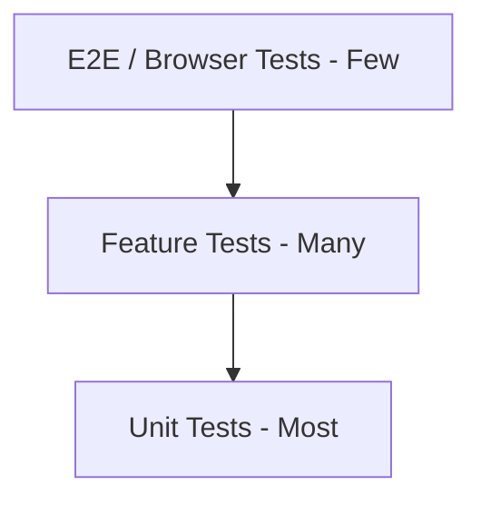

# Testing Strategy — Visite Technique Platform

Test plan, tooling, and CI pipeline for quality assurance.

---

## Testing Stack

| Tool | Purpose |
|------|---------|
| Pest PHP | Test runner and assertions |
| Laravel Testing | HTTP, Livewire, database testing |
| Mockery | Mock Twilio client and external APIs |
| PHPStan (Level 5) | Static analysis |
| Laravel Pint | Code style (PSR-12) |
| GitHub Actions | CI on pull requests |

---

## Test Pyramid



| Layer | Focus | Target Coverage |
|-------|-------|-----------------|
| Unit | Services, validators, normalizers | 90%+ on pure logic |
| Feature | HTTP routes, jobs, imports | 80%+ on critical paths |
| E2E | Full user flows (optional) | Key happy paths |

---

## Critical Test Areas

### 1. Multi-Tenancy

| Test | Assertion |
|------|-----------|
| Tenant scope filters queries | Center A cannot see Center B customers |
| Super-admin bypasses scope | Can list all centers |
| Tenant middleware sets context | `app('currentTenant')` matches user |

### 2. CSV Import

| Test | Assertion |
|------|-----------|
| Valid CSV creates records | Customers, vehicles, inspections created |
| Missing headers rejected | Batch status `failed`, error `MISSING_HEADER` |
| Invalid phone rejected | Row in `error_log` |
| Duplicate plate+expiry skipped | `skipped_count` incremented |
| Dry-run writes nothing | No inspections created, preview returned |
| Async job completes batch | Status transitions `pending` → `completed` |

### 3. Notification Scheduling

| Test | Assertion |
|------|-----------|
| Schedules generated on import | Rows in `notification_schedules` |
| Idempotent schedules | Re-import does not duplicate |
| Opt-out respected | No send when `sms_opt_in = false` |
| Due dispatcher queues jobs | Only `scheduled_at <= now()` dispatched |

### 4. Twilio Integration

| Test | Assertion |
|------|-----------|
| SMS channel sends message | Mock client receives correct `from`, `body` |
| WhatsApp uses content SID | Production template path |
| Webhook updates status | `delivered` sets `delivered_at` |
| Invalid signature rejected | 403 response |
| Retry on 5xx | Job released with delay |

### 5. Authentication & Authorization

| Test | Assertion |
|------|-----------|
| Operator cannot access admin routes | 403 |
| Center-admin can manage settings | 200 |
| Login throttling | 429 after 5 failures |
| Unauthenticated redirect | Login page |

---

## Example Pest Tests

### Phone Normalization (Unit)

```php
it('normalizes cameroon phone to e164', function () {
    $normalizer = app(PhoneNormalizer::class);

    expect($normalizer->toE164('677123456', 'CM'))
        ->toBe('+237677123456');
});
```

### Tenant Isolation (Feature)

```php
it('prevents cross-tenant customer access', function () {
    $centerA = InspectionCenter::factory()->create();
    $centerB = InspectionCenter::factory()->create();
    $customer = Customer::factory()->for($centerA)->create();
    $userB = User::factory()->for($centerB)->asOperator()->create();

    $this->actingAs($userB)
        ->get(route('customers.show', $customer->uuid))
        ->assertNotFound();
});
```

### CSV Import (Feature)

```php
it('imports valid csv and creates inspections', function () {
    $admin = User::factory()->asCenterAdmin()->create();
    $csv = UploadedFile::fake()->createWithContent('import.csv', $validCsvContent);

    $this->actingAs($admin)
        ->post(route('imports.store'), ['file' => $csv])
        ->assertRedirect();

    ProcessImportJob::dispatchSync(ImportedBatch::first());

    expect(Inspection::count())->toBe(3);
});
```

### Webhook (Feature)

```php
it('updates notification log on delivery webhook', function () {
    $log = NotificationLog::factory()->sent()->create();

    $this->post(route('webhooks.twilio.sms'), [
        'MessageSid' => $log->provider_message_id,
        'MessageStatus' => 'delivered',
    ])->assertOk();

    expect($log->fresh()->status)->toBe('delivered');
});
```

---

## Test Database

Use SQLite in-memory or dedicated MySQL test database:

```xml
<!-- phpunit.xml -->
<env name="DB_CONNECTION" value="sqlite"/>
<env name="DB_DATABASE" value=":memory:"/>
<env name="QUEUE_CONNECTION" value="sync"/>
<env name="TWILIO_ACCOUNT_SID" value="ACtest"/>
```

`QUEUE_CONNECTION=sync` runs jobs inline in tests.

---

## Factories (Planned)

| Factory | Notes |
|---------|-------|
| `InspectionCenterFactory` | With `center_settings` |
| `UserFactory` | States: `superAdmin`, `centerAdmin`, `operator` |
| `CustomerFactory` | Tenant-scoped |
| `VehicleFactory` | Linked to customer |
| `InspectionFactory` | With expiry in future |
| `ImportedBatchFactory` | States: `completed`, `failed` |
| `NotificationScheduleFactory` | States: `due`, `sent` |
| `NotificationLogFactory` | States: `delivered`, `failed` |

---

## Livewire Testing

```php
Livewire::test(ImportUpload::class)
    ->set('file', $csv)
    ->call('validateDryRun')
    ->assertSet('preview.would_create', 5)
    ->call('confirmImport')
    ->assertDispatched('import-started');
```

---

## Static Analysis & Style

```bash
# Code style
./vendor/bin/pint --test

# Static analysis
./vendor/bin/phpstan analyse --memory-limit=512M
```

`phpstan.neon` includes Laravel extension and `app/`, `config/`, `routes/`.

---

## GitHub Actions CI

`.github/workflows/ci.yml` (planned):

```yaml
name: CI

on:
  push:
    branches: [main]
  pull_request:
    branches: [main]

jobs:
  test:
    runs-on: ubuntu-latest
    services:
      mysql:
        image: mysql:8
        env:
          MYSQL_DATABASE: visite_technique_test
          MYSQL_ROOT_PASSWORD: secret
        ports: ['3306:3306']
      redis:
        image: redis:7
        ports: ['6379:6379']

    steps:
      - uses: actions/checkout@v4

      - name: Setup PHP
        uses: shivammathur/setup-php@v2
        with:
          php-version: '8.3'
          extensions: mbstring, xml, mysql, redis, bcmath, gd, zip

      - name: Install dependencies
        run: composer install --prefer-dist --no-progress

      - name: Copy env
        run: cp .env.example .env && php artisan key:generate

      - name: Run migrations
        run: php artisan migrate --force
        env:
          DB_HOST: 127.0.0.1
          DB_DATABASE: visite_technique_test
          DB_USERNAME: root
          DB_PASSWORD: secret

      - name: Pint
        run: ./vendor/bin/pint --test

      - name: PHPStan
        run: ./vendor/bin/phpstan analyse

      - name: Pest
        run: php artisan test
        env:
          DB_HOST: 127.0.0.1

      - name: Build assets
        run: npm ci && npm run build
```

---

## Manual QA Checklist (Pre-Release)

### CSV Import

- [ ] Upload valid CSV — records created
- [ ] Upload invalid CSV — errors displayed per row
- [ ] Dry-run shows preview without persisting
- [ ] Large file (5000+ rows) processes via queue with progress

### Notifications

- [ ] Twilio sandbox SMS received
- [ ] Twilio sandbox WhatsApp received
- [ ] Webhook updates dashboard delivery status
- [ ] Opted-out customer does not receive message

### Multi-Tenant

- [ ] Two centers see isolated data
- [ ] Super-admin sees all centers

### UI

- [ ] French UI strings display correctly
- [ ] Dashboard widgets load with correct counts
- [ ] Responsive layout on mobile

---

## Coverage Targets

| Area | Minimum Coverage |
|------|------------------|
| Import services | 90% |
| Notification dispatcher | 85% |
| Tenant scope | 90% |
| Controllers (critical routes) | 75% |
| Overall | 80% |

Run coverage: `php artisan test --coverage --min=80`

---

## Related Documentation

- [PLAN.md](PLAN.md) — Phase 5 quality tasks
- [DEPLOYMENT.md](DEPLOYMENT.md) — Staging and production environments
- [ROADMAP.md](ROADMAP.md) — Testing milestone timing
